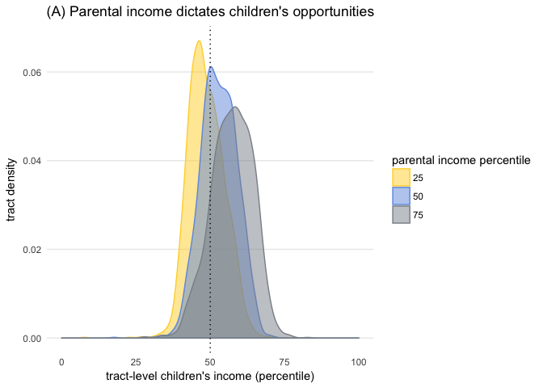
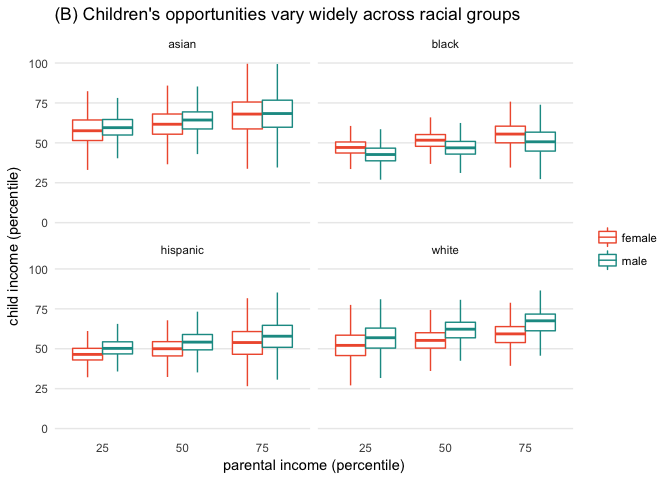
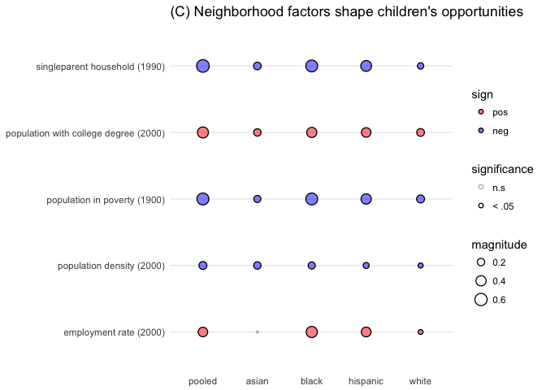
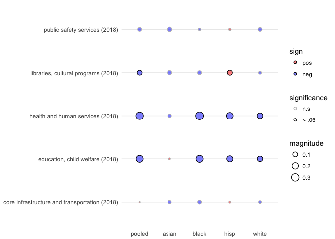
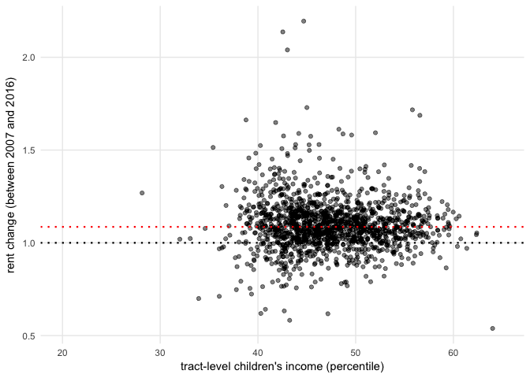

Identifying the neighborhood factors that improve children's opportunities
================
Lilla Horvath

### Reset environment and load packages

``` r
## clear env and setwd
rm(list = ls())
setwd("~/Documents/projects/op_atlas")

## load packages
library(tidyverse)
library(data.table)
library(tigris)
library(leaflet)
library(stringr)
library(RColorBrewer)
library(ggsci)

## fig configurations
cols_sim = pal_simpsons("springfield")(16)
```

### Load data

``` r
## path to local data and url
path_fds <- "data/tract_outcomes_early.csv"
path_nc <- "data/tract_covariates.csv"
path_cw <- "data/cw_ds.csv"
path_fac <- "data/facilities_201805.csv"
path_rent <- "data/medianrent.csv"
url_fds <- "https://opportunityinsights.org/wp-content/uploads/2018/10/tract_outcomes.zip"
url_nc <- "https://opportunityinsights.org/wp-content/uploads/2018/10/tract_covariates.csv"
url_cw <- "https://opportunityinsights.org/wp-content/uploads/2018/10/pctile_to_dollar_cw.csv"
url_fac <- "https://www1.nyc.gov/assets/planning/download/zip/data-maps/open-data/facilities_csv_201805.zip"
url_rent <- "blob:http://app.coredata.nyc/24fa512e-1582-417f-a916-5e6cfde1e8dc"

## load data
if (!file.exists(path_fds) & !file.exists(path_nc) & !file.exists(path_cw) & !file.exists(path_fac) & !file.exists(path_rent)) {
  
  full_ds <- fread(url_fds)
  nbh_ds <- fread(url_nc)
  cw_ds <- fread(url_cw)
  facilities_ds <- fread(url_fac)
  rent_ds <- fread(url_rent)
  
  write_csv(full_ds, path = path_fds)
  write_csv(nbh_ds, path = path_nc)
  write_csv(cw_ds, path = path_cw)
  write_csv(facilities_ds, path = path_fac)
  write_csv(rent_ds, path = path_rent)
  
} else {
  
  full_ds <- fread(path_fds)
  nbh_ds <- fread(path_nc)
  cw_ds <- fread(path_cw)
  facilities_ds <- fread(path_fac)
  rent_ds <- fread(path_rent)
  
}

## get NYC data
NYC_ds <-
  full_ds %>%
  filter(state == 36 & county %in% c(5, 47, 61, 81, 85))
NYC_tracts <- tracts(state = '36', county = c('061','047','081','005','085'))
```

1. What do New York's children of the 90s earn nowadays?
--------------------------------------------------------

### 1.1 Census tracts determines how much poor children earn

``` r
## get kir mean and n 
NYC_ds_mean_n <-
  NYC_ds %>%
  select(matches("state|county|^tract|(^kir_.*_mean$)|(^kir_.*_n$)")) %>%
  select(-matches("stycz|top|([0-9]+)"))

## convert into long format
NYC_ds_mean_n_long <- 
  NYC_ds_mean_n %>% 
  gather(measurement, value, -state, -county, -tract, na.rm = TRUE) %>%
  mutate(measurement = gsub("(.*)_(n|mean)", "\\2\\1", measurement)) %>%
  separate(measurement, c("measurement", "race", "gender"), "_") %>%
  spread(measurement, value) %>% 
  rename(kir_mean_allp = meankir, kir_n_allp = nkir) %>%
  mutate(county = str_pad(as.character(county), width = 3, pad = 0), 
         tract = str_pad(as.character(tract), width = 6, pad = 0), 
         geocode = paste0(state, county, tract),
         gender = as.factor(gender), 
         race = as.factor(race)) %>%
  select(-state, -county, -tract) %>%
  select(geocode, everything())

## get kir conditioned on parental income percentile
NYC_ds_p <-
  NYC_ds %>%
  select(matches("state|county|^tract|kir_")) %>% 
  select(-matches("^kir_(stycz|top|2)"))  %>% 
  select(-matches("\\_mean$|\\mean_se$|\\_n$"))

## convert into long format
NYC_ds_long <- 
  NYC_ds_p %>% 
  gather(measurement, value, -state, -county, -tract, na.rm = TRUE) %>%
  mutate(measurement = gsub("(.*)_(se)", "\\2\\1", measurement)) %>%
  separate(measurement, c("measurement", "race", "gender", "percentile"), "_") 

## extract se values
NYC_ds_long_se <- 
  NYC_ds_long %>% 
  filter(measurement == 'sekir') %>%
  rename(se = value) %>%
  select(-measurement)

## join measurements with se values
NYC_ds_long_all <-
  NYC_ds_long %>%
  filter(., measurement != 'sekir') %>%
  left_join(., NYC_ds_long_se, by = c('state', 'county', 'tract', 'race', 'gender', 'percentile')) %>%
  rename(avg = value) %>% 
  filter(percentile %in% c('p25','p50','p75')) %>%
  mutate(percentile = as.factor(gsub('p', '', percentile)),
         kir_mean = avg * 100,
         kir_se = se * 100, 
         county = str_pad(as.character(county), width = 3, pad = 0), 
         tract = str_pad(as.character(tract), width = 6, pad = 0), 
         geocode = paste0(state, county, tract), 
         gender = as.factor(gender), 
         race = as.factor(race)) %>%
  select(-measurement, -avg, -se) %>%
  select(geocode, everything()) 

## join with n
NYC_ds_long_all <-
  NYC_ds_long_all %>%
  left_join(., NYC_ds_mean_n_long, by = c('geocode', 'race', 'gender')) 

## wrangle spatial plotting data
NYC_ds_map <- NYC_ds_long_all %>% filter( race == 'pooled' & gender == 'pooled' & kir_n_allp >= 50, percentile == '25')
ds_merged <- geo_join(NYC_tracts, NYC_ds_map, "GEOID", "geocode")

## define plotting options
pal <- colorQuantile(palette = brewer.pal(name = "RdYlBu", 5), ds_merged$kir_mean)

## plot
l_map <- 
  leaflet() %>%
    addProviderTiles("CartoDB.Positron") %>%
    addPolygons(data = ds_merged, 
                fillColor = ~pal(ds_merged$kir_mean), 
                fillOpacity = 0.6, 
                weight = 0.2, 
                smoothFactor = 0.5) %>%
    addLegend(pal = pal, 
              values = ds_merged$kir_mean, 
              position = "bottomright", 
              title = "child income (low income parents)")

#### NOTE: the interactive map cannot be displayed on .md files on github 

#l_map
```

### 1.2 Parental income, race and neighborhood factors determine children's opportunities

``` r
## get kir density plot conditioned on parental percentile
parents_plot <- 
ggplot(data = NYC_ds_long_all %>% 
         filter( race == 'pooled' & gender == 'pooled' & kir_n_allp >= 50 ), 
       aes(x = kir_mean, 
           color = percentile, 
           fill = percentile)) + 
  geom_density(alpha = 0.5) +
  geom_vline(aes(xintercept=50), color = 'black', size = 0.5, linetype="dotted") +
  scale_color_manual(values = cols_sim[1:3], name = 'parental income percentile') +
  scale_fill_manual(values = cols_sim[1:3], name = 'parental income percentile') +
  theme_minimal() +
  labs(x = "tract-level children's income (percentile)", y = "tract density") +
  scale_x_continuous(limits=c(0, 100), breaks=seq(0,100,25)) +
  theme(panel.grid.major.x = element_blank(), 
        panel.grid.minor = element_blank()
        )

## plot child income by parent income percentile, gender and race
race_plot <-
ggplot(data = NYC_ds_long_all %>% 
         filter(race != 'pooled' & gender != 'pooled' &  race != 'other') %>%
         mutate(race = ifelse(race == 'hisp', 'hispanic', as.character(race))), aes(x = percentile, y = kir_mean, color = gender)) +
  geom_boxplot(outlier.shape = NA) +
  theme_minimal() +
  scale_color_manual(values = cols_sim[c(8, 15)]) +
  scale_fill_manual(values = cols_sim[c(8, 15)]) +
  facet_wrap(~ race, nrow = 2) +
  labs(x = "parental income (percentile)", y = "child income (percentile)") +
  scale_y_continuous(limits=c(0, 100), breaks=seq(0,100,25)) +
  theme(panel.grid.major.x = element_blank(), 
        panel.grid.minor.y = element_blank(), 
        legend.title = element_blank()
        )

## get NYC neighbourhood data from OA
NYC_nbh_ds <- 
  nbh_ds %>%
  filter(state == 36 & county %in% c(5, 47, 61, 81, 85)) %>% 
  mutate( county = str_pad(as.character(county), width = 3, pad = 0), 
          tract = str_pad(as.character(tract), width = 6, pad = 0), 
          geocode = paste0(state, county, tract)) %>% 
  select( geocode,
          ann_avg_job_growth_2004_2013, 
          emp2000, 
          matches("frac_coll_plus"), 
          job_density_2013, 
          hhinc_mean2000,
          matches("med_hhinc"),
          nonwhite_share2010,
          matches("poor_share"),
          popdensity2000,
          rent_twobed2015,
          matches("^share_"), 
          matches("singleparent_share")) 

# join with child income dataset
NYC_nbh_long <- 
  NYC_ds_long_all %>% 
  left_join(., NYC_nbh_ds, by = 'geocode') 

## get gender pooled data
NYC_nbh_long_gp <-
  NYC_nbh_long %>%
  filter(gender == 'pooled' & percentile == '25' & kir_n_allp >= 50) 

## reshape dataframe
NYC_nbh_rs_gp <- 
  NYC_nbh_long_gp %>%
  gather(ann_avg_job_growth_2004_2013:singleparent_share2000, key = 'nbh_var', value = 'nbh_var_val') %>%
  mutate(nbh_var = as.factor(nbh_var))

## evaluate correlation
nbh_kir_corr_gp <-
  NYC_nbh_rs_gp %>%
  group_by(nbh_var, race) %>%
  summarize(cor_est = cor.test(kir_mean, nbh_var_val, method = "spearman")$estimate,
            cor_p = cor.test(kir_mean, nbh_var_val, method = "spearman")$p.value) 
nbh_kir_corr_gp <- 
  ungroup(nbh_kir_corr_gp) %>% 
  mutate( cor_sign = ifelse(cor_est >= 0, "pos", "neg"), 
          cor_signif = ifelse(cor_p >= 0.05, "n.s", "< .05")) %>%
  mutate( cor_sign = factor(cor_sign, levels = c("pos", "neg")),
          cor_signif = factor(cor_signif, levels = c("n.s", "< .05")),
          race = factor(race,  levels = c("pooled", "asian", "black", "hisp", "white", "other")))
  
## visualize data on bubble plot - relevant vars for study sample kids 
nbh_kir_corr_gp <- 
  nbh_kir_corr_gp %>% 
  filter(nbh_var %in% c('singleparent_share1990', 'popdensity2000', 'poor_share1990', 'frac_coll_plus2000','emp2000')) %>% 
  mutate(nbh_var = case_when(nbh_var == 'singleparent_share1990' ~ 'singleparent household (1990)', 
                             nbh_var == 'popdensity2000' ~ 'population density (2000)',
                             nbh_var == 'poor_share1990' ~ 'population in poverty (1900)', 
                             nbh_var == 'frac_coll_plus2000' ~ 'population with college degree (2000)', 
                             nbh_var == 'emp2000' ~ 'employment rate (2000)')) %>%
  mutate(race = ifelse(race == 'hisp', 'hispanic', as.character(race)),
         race = factor(race,  levels = c("pooled", "asian", "black", "hispanic", "white", "other")))

nbh_plot <- 
  ggplot(nbh_kir_corr_gp %>% filter(race != 'other'), aes(x = race, y = nbh_var, size = abs(cor_est), fill = cor_sign, color = cor_signif)) +
  scale_fill_manual(values = alpha(c("red", "blue"), 0.5), name = "sign") +
  scale_color_manual(values = c("grey", "black"), name = "significance") +
  geom_point(shape = 21, stroke = 0.7) +
  scale_size_continuous(range = c(0.5, 5), name = "magnitude") +
  theme_minimal() +
  theme(
    panel.grid = element_line(color = "grey97"), 
    axis.title = element_blank(),
    panel.grid.major.x = element_blank()
    )

parents_plot +
  ggtitle("(A) Parental income dictates children's opportunities")
```



``` r
race_plot +
  ggtitle("(B) Children's opportunities vary widely across racial groups ")
```



``` r
nbh_plot +
  ggtitle("(C) Neighborhood factors shape children's opportunities")
```



2. Additional data sources augment predictions based on the Opportunity Atlas
-----------------------------------------------------------------------------

### 2.1 Neighborhood facilities that shape the quality of life - data from 2018

``` r
# wrangle facilities dataset 
fac_ds <- 
  facilities_ds %>%
  select(uid,
         boro,
         censtract,
         matches("^fac"), 
         capacity, 
         captype,
         util, 
         optype,
         opname, 
         datadate, 
         datasource) %>%
  mutate(boro = as.factor(boro), 
         datayear = str_extract_all(datadate, '\\d{4}'), 
         state = '36', 
         county = case_when(boro == 'Bronx' ~ '005', 
                            boro == 'Brooklyn' ~ '047',
                            boro == 'Manhattan' ~ '061',
                            boro == 'Queens' ~ '081', 
                            boro == 'Staten Is' ~ '085', 
                            boro == 'Staten Island' ~ '085'),
         tract = str_pad(as.character(censtract), width = 6, pad = 0), 
         geocode = paste0(state, county, tract)) %>%
  rowwise() %>% 
  mutate( datayear = ifelse(length(as.numeric(unlist(datayear))) > 1, max(as.numeric(unlist(datayear))), as.numeric(unlist(datayear))))

# merge datasets
fac_ds <-
ungroup(fac_ds) %>% 
  mutate(facdomain = as.factor(facdomain), 
         geocode = as.factor(geocode))

fac_sum <- 
  fac_ds %>% 
  group_by(geocode, facdomain) %>% 
  summarize(facnum = n()) %>%
  mutate(facdomain = gsub(' |, ','_',facdomain)) %>%
  spread(facdomain, facnum) 

NYC_nbh_fac <- 
  NYC_nbh_long_gp %>%
  left_join(., fac_sum, by = 'geocode') %>%
  gather(ann_avg_job_growth_2004_2013:Public_Safety_Emergency_Services_and_Administration_of_Justice, key = 'nbh_var', value = 'nbh_var_val') %>%
  mutate(nbh_var = as.factor(nbh_var))

# evaluate correlation 
nbh_fac_corr_gp <-
  NYC_nbh_fac %>%
  group_by(nbh_var, race) %>%
  summarize(cor_est = cor.test(kir_mean, nbh_var_val, method = "spearman")$estimate,
            cor_p = cor.test(kir_mean, nbh_var_val, method = "spearman")$p.value) 

nbh_fac_corr_gp <- 
  ungroup(nbh_fac_corr_gp) %>% 
  mutate( cor_sign = ifelse(cor_est >= 0, "pos", "neg"), 
          cor_signif = ifelse(cor_p >= 0.05, "n.s", "< .05")) %>%
  mutate( cor_sign = factor(cor_sign, levels = c("pos", "neg")),
          cor_signif = factor(cor_signif, levels = c("n.s", "< .05")),
          race = factor(race,  levels = c("pooled", "asian", "black", "hisp", "white", "other")))

# visualize the correlation of interest on bubble plot
ggplot(nbh_fac_corr_gp %>% 
         filter(nbh_var %in% c('Core_Infrastructure_and_Transportation',
                               'Education_Child_Welfare_and_Youth',
                               'Health_and_Human_Services',
                               'Health_and_Human_Services',
                               'Libraries_and_Cultural_Programs',
                               'Public_Safety_Emergency_Services_and_Administration_of_Justice') 
                                  & race != 'other') %>% 
  mutate(nbh_var = case_when(nbh_var == 'Core_Infrastructure_and_Transportation' ~ 'core infrastructure and transportation (2018)', 
                             nbh_var == 'Education_Child_Welfare_and_Youth' ~ 'education, child welfare (2018)',
                             nbh_var == 'Health_and_Human_Services' ~ 'health and human services (2018)', 
                             nbh_var == 'Libraries_and_Cultural_Programs' ~ 'libraries, cultural programs (2018)', 
                             nbh_var == 'Public_Safety_Emergency_Services_and_Administration_of_Justice' ~ 'public safety services (2018)')) , aes(x = race, y = nbh_var, size = abs(cor_est), fill = cor_sign, color = cor_signif)) +
  scale_fill_manual(values = alpha(c("red", "blue"), 0.5), name = "sign") +
  scale_color_manual(values = c("grey", "black"), name = "significance") +
  geom_point(shape = 21, stroke = 0.7) +
  scale_size_continuous(range = c(0.5, 5), name = "magnitude") +
  theme_minimal() +
  theme(
    panel.grid = element_line(color = "grey97"), 
    axis.title = element_blank(),
    panel.grid.major.x = element_blank()
    )
```



### 2.2 Census tracts with good opportunities have not been gentrified more - data from 2007-2011 and 2012-2016

``` r
## wrangle rent dataset
r_ds <-
  rent_ds %>% 
  select(-matches('name')) 
colnames(r_ds) <- c('geocode', 'year_2007_2011', 'year_2012_2016')  
r_ds <-
  r_ds %>%
  mutate(geocode = as.numeric(geocode)) %>% 
  filter(geocode %in% unique(NYC_ds_map$geocode)) %>% 
  mutate(mr_change = (year_2012_2016)/year_2007_2011) %>%
  mutate(geocode = as.factor(geocode)) %>%
  mutate(mr_change = ifelse(mr_change >= 2.5, NA, mr_change))

## merge datasets
NYC_nbh_fac_mr <- 
  NYC_nbh_fac %>% 
  filter(race == 'pooled') %>%
  left_join(., r_ds, by = 'geocode')

## plot child income vs median rent change
dfoi <- 
  NYC_nbh_fac_mr %>%
  select(geocode, kir_mean, mr_change) %>%
  distinct() 

ggplot(data = NYC_nbh_fac_mr, aes(x = kir_mean, y = mr_change)) +
  geom_point(alpha = 0.02) +
  geom_hline(aes(yintercept=1), color = 'black', size = 0.8, linetype="dotted") +
  geom_hline(aes(yintercept=median(mr_change, na.rm = TRUE)), linetype="dotted", color = 'red', size = 0.8) +
  theme_minimal() +
  scale_x_continuous(limits=c(20, 65), breaks=seq(20,65,10)) +
  labs(y = "rent change (between 2007 and 2016)",
       x = "tract-level children's income (percentile)") +
  theme(panel.grid.minor = element_blank()) 
```


